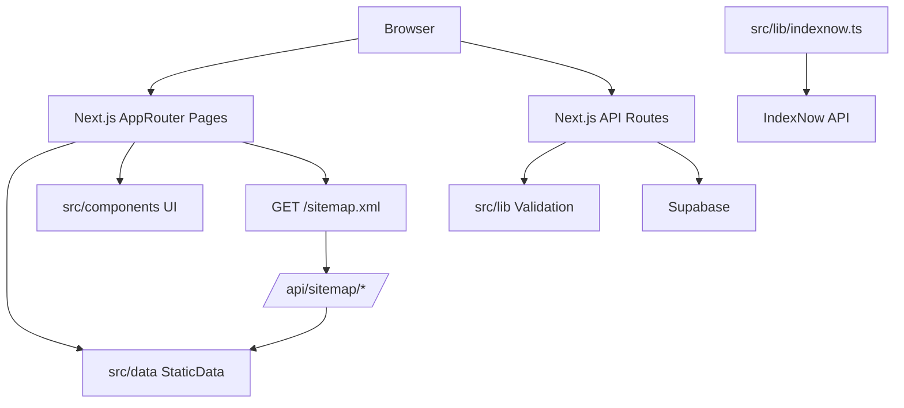

## Architecture Overview

East Coast Kink Events is a Next.js 14 App Router site that serves static listings (events/dungeons/education) and supports moderated submissions backed by Supabase. The live site is `https://www.eastcoastkinkevents.com/`.

### High-level structure

- **Pages/UI**: `src/app/**` + `src/components/**`
- **Static data**: `src/data/**`
- **Backend (route handlers)**: `src/app/api/**`
- **Platform services**:
  - Supabase clients: `src/lib/supabase.ts`, `src/lib/supabaseClient.ts`
  - SEO/constants: `src/lib/seo.ts`
  - Indexing: `src/lib/indexnow.ts`, `src/app/sitemap.xml/route.ts`

### Navigation and key user flows (as seen on the live site)

- **Browse**: Events, Dungeons, States, Education, Calendar
- **Informational**: About, Contact
- **Submissions**: “Add Event” (and other submit entry points in the UI)

### Data flow

#### Browse pages
Browse pages render from static datasets in `src/data/` and filter/sort client-side for display.
- Example: events pages import helpers from `src/data/events.js`.

#### Submission pipeline
Submissions are posted to Next.js route handlers which validate/sanitize payloads, then insert into Supabase. Admin routes handle moderation actions.

### Indexing and SEO flow

- `next.config.js` enforces canonical host/paths via redirects.
- `src/app/sitemap.xml/route.ts` generates a sitemap and attempts to include dynamic slugs by calling `/api/sitemap/*` endpoints (with timeouts and fallbacks).
- `src/lib/indexnow.ts` supports pushing URLs to IndexNow for faster discovery.

### Request/data flow diagram

### Important operational notes

- **Supabase is optional in local/dev builds**: code paths guard against missing env vars, but submission/admin features require configuration.
- **Analytics** is enabled only when `NEXT_PUBLIC_GA_MEASUREMENT_ID` is set (see `src/app/layout.tsx`).
## Architecture Overview

This repository is a Next.js App Router project. Pages and routes live under `src/app`, while reusable UI components live under `src/components`. Data for events, dungeons, and education is stored in static JS modules under `src/data`.

### Key Directories
- `src/app`: App Router pages, layouts, and API routes.
- `src/components`: Shared UI components.
- `src/contexts`: Client-side providers (auth, analytics).
- `src/data`: Static data sources (events, dungeons, education).
- `src/lib`: Shared utilities (SEO helpers, validation, Supabase client).
- `src/hooks`: Client-side hooks.
- `public`: Static assets.
- `scripts`: Node scripts for data maintenance and SEO support.

### Event Data Flow
1. Static events are defined in `src/data/events.js`.
2. Pages and components import helpers from `src/data/events.js` to display upcoming and past events.
3. The event submission form posts to `src/app/api/events/route.ts`, which validates and inserts submissions into Supabase.

### Rendering
Most pages are rendered via React components in `src/app/*`, with UI composed from `src/components`. Some pages are marked `use client` where client-only hooks are required.
