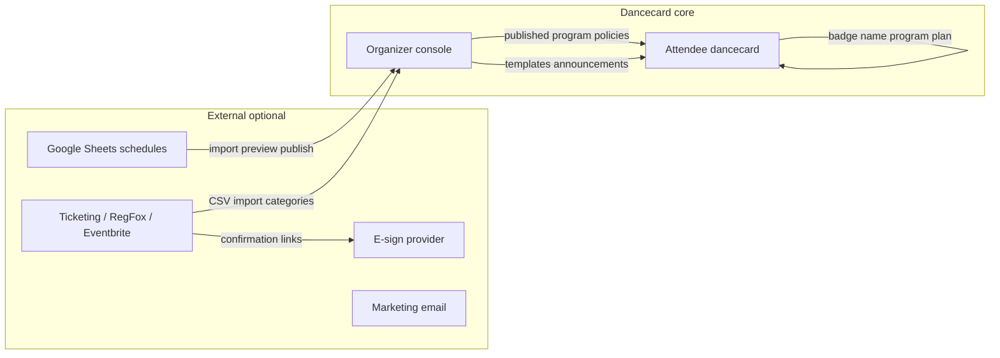

# Generic Dancecard Product Vision (ECKE Platform)

**For:** Any ECKE organizer (campouts, hotel takeovers, retreats, parties, cons)  
**About:** Dancecard organizer console + attendee dancecard in EastCoast-master  
**Status:** Planning document, May 2026  
**Implementation status:** [`GENERIC_DANCECARD_IMPLEMENTATION_TRACKER.md`](./GENERIC_DANCECARD_IMPLEMENTATION_TRACKER.md)  
**Companion docs:**

- Technical UI backlog: [`DANCECARD_UI_UX_MASTER_PLAN.md`](./DANCECARD_UI_UX_MASTER_PLAN.md)
- Long-term platform roadmap: [`DANCECARD_MASTER_PRODUCT_ROADMAP.md`](./DANCECARD_MASTER_PRODUCT_ROADMAP.md)
- Festival stress-test example (not the product target): [`PAF_PRODUCT_VISION_AND_UX_PLAN.md`](./PAF_PRODUCT_VISION_AND_UX_PLAN.md)

---

## 1. Executive summary

Dancecard is **ECKE’s reusable event operating system**: one backstage for organizers, one pocket guide for attendees. Any organizer-run event can use it. Complexity scales from a one-night hotel party to a multi-day campout with hundreds of classes and a volunteer grid.

**Organizers** open the console and see what blocks go-live in plain language (program published, rooms set, registration categories ready, staff loaded if they use shifts). They work by **job** ("build Friday’s schedule," "approve a shift swap," "email everyone about a room change"), not by database table names. Import from Excel or Google Sheets is guided, with validation and preview before anything goes live.

**Attendees** land on an **event-branded** page: sign in once, browse the real program, build a personal plan, compare availability with friends, claim open volunteer shifts if enabled, and open organizer-authored sections (map, policies, check-in, link-outs to ticketing). Staff see their shifts in the same app.

**What Dancecard owns:** schedule, rooms, people on the roster, staff/volunteer ops, registration records (categories, check-in, vetting flags), in-app messaging, policy agreements (**ECKE Sign**), and the public dancecard experience.

**What stays external (optional link-outs):** card payments (Eventbrite, RegFox, etc.), marketing email lists (Mailchimp, MailerLite), Discord, cabin matrices in spreadsheets. **Agreements** use a dual path: built-in **ECKE Sign** (policy ledger on dancecard) and optional **RabbitSign** API sync for events that already use RabbitSign. Dancecard **connects** via URLs, CSV import, webhooks, and exports.



**PAF materials** (Primal Arts Fest grids, staff workbooks, attendee info sites) are a **stress test** that the engine can handle extreme complexity. Mass appeal comes from simpler navigation, trustworthy import, one people story, and attendee pages that feel like a weekend guide, not from cloning one festival.

---

## 2. Event types on one platform

Same product, different **event profiles** (labels + highlighted modules + default content blocks). Profiles are configuration, not separate codebases.

| Profile | Typical use | Default vocabulary | Modules emphasized |
| --- | --- | --- | --- |
| Multi-day camp / retreat | Outdoor campout, land event | Class, cabin area, volunteer shift | Program, rooms, staff, import |
| Hotel takeover | Floors, ballrooms, tracks | Class, track, room | Program, rooms, registrants |
| Single-venue party | One building, one night | Set, room, host | Program, registrants (light staff) |
| Conference-style | Tracks, speakers, panels | Session, track, speaker | Program, schedule credits, directory |
| Volunteer-heavy | Greeters, door, kitchen, safety | Shift, station, role | Staff shifts, swaps, open shifts |

Organizers pick a profile at create or in Settings. Copy and sidebar emphasis adjust; hidden modules stay available under Tools or entitlements.

### Universal attendee journey

| Stage | What happens | Dancecard role |
| --- | --- | --- |
| Discover | Learn dates, location, vibe | ECKE directory, event marketing site |
| Register | Pick ticket category, pay elsewhere | Link-out + optional CSV/sync to Registrants |
| Pre-event info | Policies, map, packing list | Organizer content sections on dancecard |
| On-site | Check-in, badge, find activities | Program, map, check-in info, badges print |
| During event | Attend activities, staff duties | Personal plan, compare, staff panel |
| After | Thank-you, photos, feedback | Messaging template, exports |

---

## 3. The two audiences

### Organizer console (backstage)

**Who:** Event owner, programming lead, registration desk, staff lead, safety/media leads (role-based).  
**Mindset:** "Stage manager," not "database admin."  
**Success:** Every common question answered in under three clicks from Overview, with no dead-end tabs or jargon.

**Current shell** (`organizerNavConfig.ts`): Home, Schedule (Program, Rooms, Schedule credits, Import), People (Directory, Registrants, Trusted roles, Staff shifts, Shift swaps, Coverage roles, Badges), Event (Settings), Outreach (Messaging), Tools (Exports, Integrations, Media).

**Target:** Six job-based areas (Section 4) with People as one hub story. Tools and advanced modules stay tucked away for small events.

### Attendee dancecard (weekend guide)

**Who:** Ticket holders, presenters, staff, photographers.  
**Gold standard:** Mobile-first **accordion or section list** of everything about the weekend, with schedule superpowers inside (program grid, my plan, compare, reservations, open shifts).

**Today in code:** Event-branded landing (`PublicDancecardLanding`), sign-in, bottom tabs Program / My card / Compare / Reserve (`AttendeeBottomNav`). Strong for scheduling; weaker for organizer-authored info blocks (lodging, transportation, vendor list, etc.).

**Target:**

```text
+------------------------------------------------------------------+
|  {Event name} Dancecard                    [Sign in]              |
+------------------------------------------------------------------+
|  > Manage registration     (link to external ticketing if set)   |
|  > Venue map               (map page from settings)               |
|  > Program schedule        (grid + My card)                       |
|  > Lodging & travel        (markdown from settings, optional)     |
|  > Check-in                (hours, badge name, what to bring)     |
|  > Policies & agreements   (summary + link-out to e-sign)         |
|  > Staff (if staff)        (my shifts, open shifts, swaps)         |
|  > Compare & reserve       (mutual availability)                    |
+------------------------------------------------------------------+
```

Section titles and which blocks appear are **organizer-configured**, not hardcoded to any one festival.

---

## 4. Information architecture (jobs, not tables)

Recommended organizer mental model. Items map to existing tabs in parentheses.

### A. Setup (before the event)

| Job | What you do here | Maps to |
| --- | --- | --- |
| Event basics | Name, dates, timezone, slug, logo, status | Settings |
| Event profile | Camp / hotel / party labels and module hints | Settings |
| Registration setup | Categories, form fields, access codes | Settings + Registrants |
| Branding | Colors, hero, public dancecard look | Settings |
| Policies | Camper-facing policy summary | Settings |
| Features / modules | Swaps, vetting, embeds, coverage | Integrations |
| Readiness | Pre-flight checklist | Overview |

### B. Schedule and rooms

| Job | What you do here | Maps to |
| --- | --- | --- |
| Build program | Time x room grid, publish | Program |
| Import schedule | From spreadsheet (program or staff grid) | Import |
| Manage rooms | Capacities, colors, availability | Rooms |
| Credit presenters | Who is listed on each public item | Schedule credits |
| Fix conflicts | Overlaps, missing rooms | Overview + Program |

*Assign lead presenter/host on the Program grid when possible. Schedule credits is QA for gaps, not the only place to assign people.*

### C. People (one story, multiple tabs)

| Job | What you do here | Maps to |
| --- | --- | --- |
| Roster | Everyone involved at the event, filter by role | Directory |
| Signups | Ticket/registration records, check-in, vetting | Registrants |
| Trusted roles | Presenter, photographer, coverage applications | Trusted roles |
| Staff schedule | Shifts by day and role | Staff shifts |
| Approve shift trades | Pending swaps | Shift swaps |
| Play-space coverage | Optional coverage windows, headcount | Coverage roles |
| Print badges | Layout, filter checked-in | Badges |

**Narrative for organizers:**

- **Signups** = people who registered (often imported from external ticketing).
- **Roster** = people on the schedule or in ops (presenters, staff, DJs).
- Same human may appear in both; linking UX is a Phase B goal.

### D. Registration and money-adjacent

| Job | What you do here | Maps to |
| --- | --- | --- |
| Ticket categories | Weekend, day pass, staff comp, vendor | Settings |
| Import attendees | CSV from Eventbrite, RegFox, etc. | Registrants |
| Deadlines | Agreement due dates (display + reminders) | Settings + Messaging |
| Upgrades / refunds | Link to external ticketing, notes on record | Registrant detail |

*Payments stay in external systems. Dancecard mirrors category, status, check-in, and vetting.*

### E. Communications

| Job | What you do here | Maps to |
| --- | --- | --- |
| Email templates | Welcome, schedule change, room change | Messaging |
| Send test / campaign | Preview audience and body before send | Messaging |
| Segmented sends | By category or role | Phase 3 |

### F. Day-of operations

| Job | What you do here | Maps to |
| --- | --- | --- |
| Check-in desk | Mark checked in, search by badge name | Registrants |
| Print badges | Filter who is on-site | Badges |
| Who is on shift now | Staff grid filters | Staff shifts |
| Room or time change | Edit program item + send template | Program + Messaging |
| Export desk lists | CSV for registration, photographers | Exports |

### G. After the event

| Job | What you do here | Maps to |
| --- | --- | --- |
| Thank-you message | Template | Messaging |
| Export attendance | Registrants + schedule credits | Exports |
| Archive schedule | JSON snapshot | Exports |

### Target sidebar grouping (shipped — Core Reduction, May 2026)

See also [DANCECARD_CORE_REDUCTION_PLAN.md](./DANCECARD_CORE_REDUCTION_PLAN.md).

| Section | Contains |
| --- | --- |
| **Home** | KPIs + setup task list (GOV.UK pattern); dynamic readiness warnings |
| **Schedule** | Program, Room availability, Import (schedule credits via Conflict dock link) |
| **People** | Signups, Roster, Staff, Applications, Swaps, Badges, Coverage |
| **Communications** | Messaging |
| **Settings** | Essentials (basics, branding, registration, policies & agreements, rooms) · More (tracks, attendee guide) · Advanced; optional quick-setup wizard link |
| **Tools** | Exports (includes no-photo CSV), Integrations |

Small events hide Compare/Reserve attendee tabs via event profile (`camp`, `party`) and entitlements.

---

## 5. Screen-by-screen wireframes (ASCII)

Generic names; replace `{Event}` with organizer title.

### Hub (organizer event list)

```text
+----------------------------------------------------------+
|  ECKE Organizer               [Your account]  [New event]  |
+----------------------------------------------------------+
|  Your events                                              |
|  +------------------------+  +------------------------+ |
|  | Spring Campout 2026    |  | Hotel Takeover Nov     | |
|  | Jun 12-14, 2026        |  | Nov 8-10, 2026         | |
|  | Readiness ====-- 68%   |  | Readiness ======  91%  | |
|  | [Open console]         |  | [Open console]         | |
|  +------------------------+  +------------------------+ |
+----------------------------------------------------------+
```

### Event home / Overview

```text
+----------+-----------------------------------------------+
| SIDEBAR  |  Overview - {Event}                           |
|          |  "2 things to fix before go-live"             |
| Overview |  +----------------+ +----------------+          |
| Program  |  | ! Program not  | | ! 5 classes    |          |
| ...      |  |   published    | |   need host    |          |
|          |  +----------------+ +----------------+          |
|          |  At a glance: 32 activities | 89 signups       |
|          |  Quick: [Program] [Import] [Public dancecard] |
+----------+-----------------------------------------------+
```

*Exists:* `OrganizerEventDashboard` + `/readiness` API.

### Program

```text
+----------+-----------------------------------------------+
|          |  Program          [Day v] [Publish] [+ Item]    |
|          |  +-----+-----+-----+-----+-----+              |
|          |  |Main |Side |Pool |Dungeon| ... |  time rows |
|          |  +-----+-----+-----+-----+-----+              |
|          |  |     |Intro|     |     |     |  2:00-3:30   |
|          |  +-----+-----+-----+-----+-----+              |
|          |  click cell -> drawer: title, hosts, notes,   |
|          |  photo policy, duplicate, delete              |
+----------+-----------------------------------------------+
```

*Exists:* program grid; ongoing polish per UI master plan.

### Import (program + staff)

```text
+----------+-----------------------------------------------+
|          |  Import                                       |
|          |  ( ) Program schedule  ( ) Staff / volunteer   |
|          |  [Upload xlsx or csv]                           |
|          |  +-----------------------------------------+  |
|          |  | PREVIEW: 8 new, 2 moved, 1 conflict    |  |
|          |  | [highlight changes before publish]      |  |
|          |  +-----------------------------------------+  |
|          |  Fix errors listed above | [Publish import]   |
+----------+-----------------------------------------------+
```

*Exists:* `ScheduleImportPanel`, staff grid parser for person x half-hour workbooks. **Phase A/B:** stronger diff preview, auto-detect format, runbook card on page.

### People hub (target: single entry, tabs inside)

```text
+----------+-----------------------------------------------+
|          |  People          [Signups|Roster|Staff|Apps]  |
|          |  Roster tab:  [Search........]  Role: [All v] |
|          |  +-----------------------------------------+  |
|          |  | Name          Roles        Reg status    |  |
|          |  | Alex Kim      Presenter    confirmed      |  |
|          |  | Jordan Lee    Staff        checked_in     |  |
|          |  +-----------------------------------------+  |
|          |  Detail: contact, shifts, classes, notes      |
+----------+-----------------------------------------------+
```

*Today:* separate Directory and Registrants tabs; merge UX is Phase B.

### Registrants (Signups tab)

```text
+----------+-----------------------------------------------+
|          |  Signups  [Import CSV]  [External sync*]    |
|          |  Filter: Category | Status | Vetting          |
|          |  +-----------------------------------------+  |
|          |  | Badge name   Category    Check-in  Status |  |
|          |  | RiverSong    Weekend     [x]       ok      |  |
|          |  +-----------------------------------------+  |
|          |  *Phase 3: webhook from ticketing provider    |
+----------+-----------------------------------------------+
```

*Exists:* `RegistrantsPanel`.

### Staff shifts

```text
+----------+-----------------------------------------------+
|          |  Staff shifts   Day: [Saturday v]  [Import]   |
|          |  +-------+-------+-------+-------+------+     |
|          |  | 10:00 | 10:30 | 11:00 | ...   | Door |     |
|          |  +-------+-------+-------+-------+------+     |
|          |  | Sam   | Sam   | Lunch | ...   |      |     |
|          |  +-------+-------+-------+-------+------+     |
|          |  Open shifts: 3   Hours: 12 / 16 expected      |
+----------+-----------------------------------------------+
```

*Exists:* `StaffShiftsPanel` + grid import.

### Schedule credits (QA)

```text
+----------+-----------------------------------------------+
|          |  Schedule credits                             |
|          |  Public listings missing a host: 6            |
|          |  [Activity title] -> assign on Program grid   |
+----------+-----------------------------------------------+
```

*Exists:* `AssignmentBoardPanel` repurposed as credits / gaps.

### Messaging

```text
+----------+-----------------------------------------------+
|          |  Messaging                                    |
|          |  Templates: Welcome | Schedule update | ...   |
|          |  [Create announcement...]  preview before send |
|          |  History: "Room change Sat" - sent 120        |
+----------+-----------------------------------------------+
```

*Exists:* `MessagingPanel`.

### Attendee public landing

```text
+----------------------------+---------------------------+
|  {Event name}              |  Sign in to your dancecard|
|  {dates}                   |  [username]               |
|  [Sign in] [Create account]|  [password]               |
|  Map | Policies | Program    |                           |
|  Upcoming (peek)           |                           |
|  How compare works         |                           |
+----------------------------+---------------------------+
```

*Exists:* `PublicDancecardLanding`.

### Attendee signed-in (target)

```text
+------------------------------------------+
|  {Event}   Program  My card  Compare  ... |
+------------------------------------------+
|  v Manage registration (external link)    |
|  v Venue map                              |
|  v Program (Happening now + grid)        |
|  v My weekend plan                         |
|  > Lodging & travel (organizer content)    |
|  > Check-in                                |
|  > Policies                                |
|  > Staff (if staff)                        |
+------------------------------------------+
```

*Partial:* program/compare exist; accordion content IA is Phase B.

---

## 6. Gap analysis (generic platform)

| Need (any event) | Today in codebase | Gap |
| --- | --- | --- |
| Create event and go live | Hub + settings wizard | Faster path to first published schedule |
| Build schedule | Program grid + publish | Mobile-friendly read-only for presenters |
| Import from Sheets | Import panel, program + staff grid parsers | Diff preview weak; auto-detect needs polish |
| Avoid double-booking | Conflict scanner + readiness | Surface conflicts on Overview prominently |
| Who is hosting / teaching | Program drawer + schedule credits | Credits should be QA; assign on create |
| One people story | Directory + Registrants separate | Unified People hub with tabs (Phase B) |
| Ticket list and check-in | Registrants + badges | External ticketing sync optional (Phase 3) |
| Volunteers | Staff shifts, swaps, open shifts | Hide for small profiles |
| Email / announcements | Messaging | Clearer audience + preview before send |
| Attendee weekend guide | Landing + program tabs | Organizer content sections / accordion |
| Small event simplicity | All modules visible | Event profile hides noise |
| Per-event branding | Settings theme, logo | Continue polish on public dancecard |
| Multi-event orgs | Organizer hub | Roles per event exist |
| Agreements (ECKE Sign) | Policy ledger + attendee sign flow | Agreements panel in settings; attendee policies page |
| RabbitSign sync | Webhook + Integrations config | API key + status on registrant |
| Optional integrations | Integrations panel | RegFox API, MailerLite sync = Phase 3 examples |
| Lodging matrix | Not in core product | Optional embed or link-out; not required for v1 |

**Honest summary:** Backend capabilities (phases 0 to 7 in master roadmap) are largely in place. Mass-market readiness depends on **navigation by job**, **trustworthy import UX**, **unified People story**, and **attendee info architecture**, not on more festival-specific features.

---

## 7. Phased roadmap (ease of use first)

### Phase A: Trust and clarity (1 to 2 weeks)

Focus: language, Overview, import trust, messaging clarity. No new backends required.

- Copy pass: **class / activity / shift** vocabulary (Section 8); no attendee-facing "session."
- Overview: generic readiness ("Schedule imported recently," "Staff loaded for event days") with links to Import.
- Import: two clear paths **Program schedule** and **Staff / volunteer grid**; validation errors in plain language; runbook link from Overview.
- Messaging: compose flow shows **who receives** and **preview** before send.
- Attendee landing: stub sections linking to external ticketing and e-sign URLs from settings.
- Nav hygiene: no stray query params between tabs; tab labels match Section 4 jobs.

*Aligns with UI master plan Phases 1 to 2.*

### Phase B: Structural UX (3 to 5 weeks)

Focus: job-based navigation; People hub; attendee weekend guide.

- Sidebar regroup per Section 4 target (Schedule, People, Communications, Settings, Tools).
- People hub: Signups | Roster | Staff | Applications (wrap existing panels).
- Registrant ↔ roster linking UX when the same person exists in both lists.
- Import: diff highlight before publish; staged undo for destructive program edits.
- Attendee: accordion driven by **organizer content blocks** in settings (markdown/HTML).
- Check-in section for attendees (hours, badge name, what to bring) from settings.
- Event profile presets (camp / hotel / party) for labels and module visibility.

*Aligns with UI master plan Phases 5 to 6.*

### Agreements module (shipped in platform push)

- **ECKE Sign:** Attendee reads published policies, types legal name, acceptance stored in `dancecard_registrant_policy_acceptances` with audit fields.
- **RabbitSign:** Organizer configures webhook + optional API key; `rabbitsign_status` on registrant; hybrid mode requires both.
- **Settings:** Agreements mode (ECKE / RabbitSign / Hybrid), required policy kinds, deadline display.

### Phase C: Integrations (6+ weeks, per customer demand)

Pick by market, not as core requirements:

- Ticketing webhook or scheduled export (RegFox, Eventbrite, etc.).
- Marketing email audience sync (Mailchimp, MailerLite, SendGrid).
- RabbitSign folder create API (live client beyond webhook stub).
- Google Sheets read-only pull with same preview UI as file upload.
- Badge vendor PDF export format.
- Lodging assignment module or embed (only if multiple customers need it).

---

## 8. Copy and language guide

### Global rules

| Avoid | Use instead | Notes |
| --- | --- | --- |
| Session (attendee-facing) | Class, activity, or set | "Add to your dancecard" |
| Slot (user-facing) | Time block or class time | OK in organizer tooltips sparingly |
| Registrant (attendee-facing) | Your registration or badge name | |
| Vetting (attendee-facing) | Trusted role application | Photographers, presenters, etc. |
| DM (user-facing) | Coverage role or play-space monitor | Spell out on first use; hide if module off |
| Entitlements | Features or modules | Organizer settings only |
| Publish (program) | Go live on dancecard | |
| Database / migration / internal error | Setup incomplete or Something went wrong | Never expose stack traces |

**Tone:** warm, direct, community-event voice. Short sentences. Every screen leads with **what this page is for** and **the next sensible action**.

### Vocabulary by event profile

| Concept | Camp / retreat | Hotel takeover | Party | Conference |
| --- | --- | --- | --- | --- |
| Scheduled item | Class | Class | Set / activity | Session |
| Lead person | Instructor | Presenter | Host | Speaker |
| Space | Room / cabin area | Room / track | Room | Room / track |
| Volunteer block | Shift | Shift | Shift (if any) | Shift |
| Safety float | Coverage role | Coverage role | Door / float | Coverage role |

Organizers can override default labels in Settings when a profile does not fit.

### Activity types (generic)

- **Class** (or session): taught block with a lead and optional co-teachers.  
- **Activity**: meals, registration windows, socials, rituals spanning one or more rooms.  
- **Shift**: staff or volunteer duty on the staff grid.  
- **Coverage**: optional play-space or safety window (module may be off).  
- **Room**: any bookable location in the program grid (match import column headers).

### PAF-only examples (optional integrations, not product requirements)

These appear in [`PAF_PRODUCT_VISION_AND_UX_PLAN.md`](./PAF_PRODUCT_VISION_AND_UX_PLAN.md) as **one festival’s** tooling:

- RegFox, RabbitSign, MailerLite, Primal Hunt, cabin matrices, meal deadline cells in a grid.

For the generic platform, document them under **Integrations** as examples organizers can link or import from, not as shipped defaults.

---

## 9. Import strategy (any event)

### Supported patterns

| Pattern | Typical source | Detection |
| --- | --- | --- |
| Program table | Rows = times, columns = rooms, cells = titles | Flat CSV/xlsx or grid export |
| Staff / volunteer grid | Tabs = days; rows = roles; columns = half-hours; cells = names or duty labels | Filename heuristics + grid parser |
| People CSV | Name, email, category, badge name | Registrants import |
| Roster CSV | Presenters and staff list | Directory import |

### Robust import checklist (product behavior)

1. **Upload** xlsx/csv (or paste export from Google Sheets).  
2. **Detect** program vs staff grid when possible; let organizer confirm.  
3. **Validate** every row: title, parseable times, known room names (offer to create rooms).  
4. **Preview** new, changed, removed, conflicts before publish.  
5. **Stage** fixes on import board; drag unplaced rows when supported.  
6. **Publish** atomically with stable IDs so attendee dancecard selections survive updates.  
7. **Log** batch with filename and timestamp in import history.  
8. **Notify** optional schedule-change notifications for affected saved items.

### Operational rhythm (organizer-facing copy)

Whenever the master spreadsheet changes: download fresh export, import with preview, fix validation errors, publish, spot-check one day and one room column, then send a schedule-update announcement if times moved.

Event window dates and timezone in Settings must be set before day-name columns in staff grids can map to real dates.

### Stress-test reference

A complex multi-day festival workbook (program grid + person x half-hour staff tabs) validates parsers and UI under load. See PAF doc Section 9 for a concrete example; generic events may use simpler sheets with the same import flow.

---

## 10. Open questions (platform decisions)

1. **People hub:** Single nav item with tabs vs keep Directory and Registrants as siblings?  
2. **Attendee home:** Dancecard as primary info site vs marketing site + dancecard for schedule only?  
3. **Badge printing:** Standard Avery/Brother vs custom PVC before layout investment?  
4. **E-sign:** Link-out only vs store signed flag on registrant (manual or API)?  
5. **Ticketing:** CSV import only vs webhook per provider?  
6. **Lodging:** Out of scope, link-out, or future module?  
7. **Staff vs coverage:** One source of truth or two optional modules with clear labels?  
8. **Event profiles:** Ship as settings presets only, or wizard step at create?  
9. **Canonical public URL:** Marketing slug vs dancecard slug (registry already supports aliases).

---

## 11. Phase A engineering checklist (next 2 weeks)

Concrete checklist for engineering plus one non-technical organizer walkthrough on sandbox:

- [ ] **Copy pass:** Attendee-facing "session" to **class** or **activity** on landing, program peek, messaging presets.  
- [ ] **Overview:** Readiness items "Schedule import fresh" and "Staff loaded for event days" with Import links (generic copy).  
- [ ] **Import panel:** Top runbook card (download xlsx, pick program vs staff, set event dates first, preview before publish).  
- [ ] **Import test:** Sandbox event with small program csv and staff grid sample; zero untitled rows after publish.  
- [ ] **Attendee stubs:** Manage registration + check-in sections (links from settings URLs).  
- [ ] **Messaging:** Confirm preview and recipient summary before send.  
- [ ] **Walkthrough:** Organizer completes Overview to Import to Program edit to test message without CLI.  
- [ ] **Deploy:** Smoke `npm run dancecard:smoke` after deploy per `dancecard-first-run.md`.  
- [ ] **Decide open question #2** (single attendee home vs split with marketing site).

Phase B tickets: People hub shell, sidebar regroup, attendee content accordion, import diff UI.

---

## 12. Reference links

| Resource | URL / path |
| --- | --- |
| UI technical plan | [`DANCECARD_UI_UX_MASTER_PLAN.md`](./DANCECARD_UI_UX_MASTER_PLAN.md) |
| Master product roadmap | [`DANCECARD_MASTER_PRODUCT_ROADMAP.md`](./DANCECARD_MASTER_PRODUCT_ROADMAP.md) |
| PAF stress-test vision (example only) | [`PAF_PRODUCT_VISION_AND_UX_PLAN.md`](./PAF_PRODUCT_VISION_AND_UX_PLAN.md) |
| First-run / import commands | [`dancecard-first-run.md`](./dancecard-first-run.md) |
| Organizer nav source of truth | `src/components/dancecard/organizer/shell/organizerNavConfig.ts` |

---

*Document created May 2026. Generic ECKE platform vision; PAF doc retained as complexity benchmark only.*
