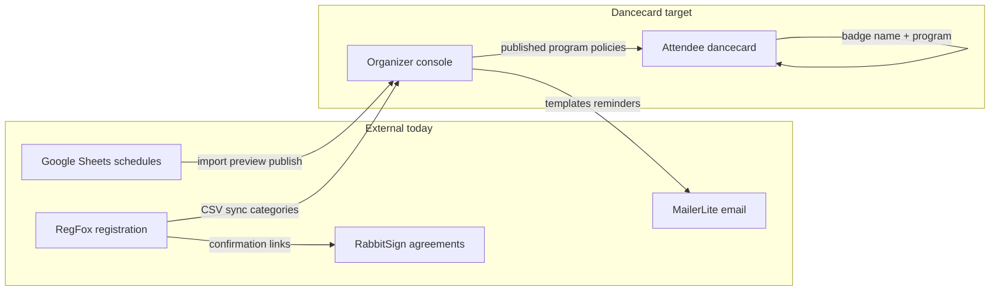

# PAF Product Vision and UX Plan

**For:** Primal Arts Fest (PAF) organizers and producers  
**About:** Dancecard organizer console + attendee dancecard in EastCoast-master  
**Status:** Planning document, May 2026  
**Companion:** Technical UI phases live in [`DANCECARD_UI_UX_MASTER_PLAN.md`](./DANCECARD_UI_UX_MASTER_PLAN.md). This doc is the human story for PAF, not a duplicate of that backlog.

---

## 1. Executive summary

When Dancecard is "done" for PAF, it should feel like **one calm backstage desk** for organizers and **one pocket guide** for campers.

**Organizers** open the console and immediately see what still blocks go-live (program published, rooms set, staff grid loaded, registrants synced). They fix problems in plain language screens grouped by the job they are doing ("load Thursday's classes," "approve a shift swap," "email everyone about a room change"), not by database table names. Importing the official Google Grid or staff workbook is a guided flow with a preview, not a scary technical step.

**Attendees** land on a mobile-first page that mirrors what they already trust on the PAF website: expandable sections for registration help, map, schedule, cabins, check-in, and policies. Sign in once, build a personal weekend plan from the real program grid, compare availability privately with friends, and get clear alerts when something moves. Staff see their shifts in the same app, not a separate spreadsheet link.

**What we are not trying to be (yet):** a full replacement for RegFox payments, RabbitSign legal workflows, or MailerLite marketing automation. Dancecard **connects** to those realities (links, exports, category labels, deadlines) while owning schedule, people-on-site, staff ops, and the attendee program experience.



---

## 2. What PAF actually is (from your materials)

Primal Arts Fest is a **multi-day outdoor kink arts retreat** (PAF26: roughly **May 7 to 11, 2026**, America/New_York). The event mixes education, ritual fire nights, vendor markets, play spaces, cabins/tents, and heavy volunteer/staff coordination.

### Attendee journey (inferred)

| Stage | What happens | Tools involved today |
| --- | --- | --- |
| Discover | Learn about dates, location, vibe | Website, ECKE directory, social |
| Register | Pick ticket category, cabin/meal options, pay | **RegFox** (`primalarts.regfox.com`) |
| Legal / policies | Sign waivers, COVID, code of conduct, photo release | **RabbitSign** (linked after RegFox confirmation) |
| Pre-event info | Password-gated "Attendee Area" on website | **primalartsfest.com** (Welcome Campers style accordion) |
| Community | Discord access verified by badge name + email | Discord |
| On-site | Check-in, badge, find classes and rooms | Registration desk, printed grid, dancecard (target) |
| During event | Attend classes, meals, rituals, vendor time | Program grid, camp map, personal plan |
| After | Strike for some, thank-you comms, photos | Email newsletter, staff grid |

Registration confirmation email (Dec 2025 sample) spells out: **required agreements by May 1, 2026**, attendee area password, Discord verification, and RegFox self-service for upgrades.

### Staff and volunteer ops (inferred)

- Roles include **MOD**, **Supply Runner**, **Strike**, build crew, greeters, presenter liaison, coverage roles, etc.
- Staff acceptance email: comp admission + cabin + meal plan; **shift times sent later** based on headcount.
- **Staff & Volunteer Schedule** workbook is a **person x half-hour grid** by day tab: Tuesday/Wednesday build, Thursday through Sunday festival, Monday strike. Cells hold duty names (Lunch, Dinner, role blocks) or person names on build days.
- Build-day notes: arrive ready at 11 am, may enter after 10 am, meals provided, guest fee rules.

### Programming (inferred)

Official program lives in **PAF26 Schedule Daily At-A-Glance & Grid** ([Google Sheet](https://docs.google.com/spreadsheets/d/14gT9gufCcbHoDtabJeGSRSAkwhiEFUfGdDQcw-2Ju1U/edit?gid=1445461642#gid=1445461642)):

- **Grid sheet:** rows = time blocks, columns = venues (Barn, Class Cabins E&F, Dining Hall Deck, Dungeon areas, fire circles, Pavilion, spa cabins, vendor market, Uggla's Forge, etc.).
- **Daily rhythm:** registration windows, meals, class blocks (often 1:30 to 3 pm), happy hour, ritual fire nights, midnight snack.
- **Special tracks:** Primal Hunt, Uggla's Forge appointments, make-your-own workshops, "all locations" announcements.
- **Monday strike sheet:** different column set (Lower Fire, Dining Hall, Cabins, Tent Sites) for teardown and farewell ritual.

Sheet tabs referenced in exports: `Grid`, `Thursday`, `Friday`, `Saturday`, `Sunday`, `Monday`, `Class Information`.

### Registration and money-adjacent (inferred)

- Categories implied by emails and ops: attendee, staff/presenter comp, meal plans, cabin beds, vendors, photographers.
- **Payments and refunds stay in RegFox** for now; Dancecard should track **category, status, check-in, vetting**, and deadlines.
- Comp codes and staff registration links are emailed manually today.

### Communications (inferred)

- Transactional: RegFox confirmations, staff acceptance, policy reminders.
- Broadcast: MailerLite-style newsletters ("Just checking in" sample).
- On-site: room changes, hunt safety, meal deadlines embedded in grid cells.
- Target: organizer sends **schedule update** and **room change** templates from Dancecard (Messaging panel exists) without replacing MailerLite entirely.

---

## 3. The two audiences

### Organizer console

**Who:** Sam and core producers, track leads, registration desk, staff lead, safety lead.  
**Mindset:** "Stage manager" not "database admin."  
**Success:** Every question answered in under three clicks from Overview, with no dead-end tabs.

Current shell (`organizerNavConfig.ts`) already groups:

- Home: Overview  
- Schedule: Program, Rooms, Schedule credits, Import  
- People: Directory, Registrants, Trusted roles, Staff shifts, Shift swaps, Coverage roles, Badges  
- Event: Settings  
- Outreach: Messaging  
- Tools: Exports, Integrations, Media  

**Gap:** Navigation is still shaped like the product's internal modules. Section 4 reframes it by **job to be done** for PAF.

### Attendee dancecard

**Who:** Registered campers, presenters, staff (dual mode), photographers.  
**Gold standard:** PAF **Welcome Campers** accordion on the attendee website (password area described in RegFox confirmation).

Typical accordion topics (from your screenshots and confirmation email):

- Manage registration (RegFox link + how-to)  
- Camp address and map  
- Program and schedule  
- Cabins / lodging  
- Check-in hours and process  
- Transportation  
- Vendors  
- Policies and agreements  
- Discord access  

**Today in code:** `PublicDancecardLanding` is a marketing-style split layout: hero, sign-in, program peek, map/policies links. Signed-in users get bottom tabs: **Program**, **My card**, **Compare**, **Reserve** (`AttendeeBottomNav`). That is strong for scheduling friends, weak for "everything a camper needs in one accordion."

**Target:** Attendee IA = **Welcome Campers structure** on the outside, **dancecard superpowers** on the inside (personal plan, compare, reservations, staff shifts).

```text
+------------------------------------------------------------------+
|  PAF26 Dancecard                    [Sign in]                     |
+------------------------------------------------------------------+
|  > Manage registration     (link out to RegFox + help)          |
|  > Camp map                (venue map page)                       |
|  > Program schedule        (full grid + My card)                  |
|  > Cabins & lodging        (static / embed from settings)         |
|  > Check-in                (hours, what to bring, badge name)     |
|  > Policies & agreements   (policy summary + RabbitSign link)     |
|  > Staff (if staff)        (my shifts, open shifts, swaps)      |
|  > Compare & reserve       (existing mutual availability)         |
+------------------------------------------------------------------+
```

---

## 4. Information architecture (jobs, not tables)

Recommended sidebar for PAF organizers. Items map to existing tabs where noted.

### Before the event (setup)

| Job | What you do here | Maps to tab |
| --- | --- | --- |
| Event basics | Dates, timezone, status, public slug, logo | Settings |
| Registration setup | Categories, form fields, access codes, RegFox import | Settings + Registrants |
| Policies | Publish camper-facing policy summary | Settings |
| Entitlements | Turn modules on (swaps, vetting, embeds) | Integrations |
| Readiness | Pre-flight checklist | Overview |

### Schedule and rooms

| Job | What you do here | Maps to tab |
| --- | --- | --- |
| Build program | Time x room grid, publish | Program |
| Import program | From PAF Grid xlsx | Import |
| Manage rooms | Capacities, colors, availability | Rooms |
| Credit presenters | Who taught each class | Schedule credits |
| Fix conflicts | Overlaps, missing rooms | Overview + Program |

### People

| Job | What you do here | Maps to tab |
| --- | --- | --- |
| Everyone at the event | Filter by role | Directory |
| Registration list | Import CSV, check-in, vetting flags | Registrants |
| Trusted roles | Presenter, photographer, DM applications | Trusted roles |
| Staff schedule | Shifts by day and role | Staff shifts |
| Approve shift trades | Pending swaps | Shift swaps |
| Play-space coverage | DM windows, headcount | Coverage roles |

### Registration and money-adjacent

| Job | What you do here | Maps to tab |
| --- | --- | --- |
| Ticket categories | Weekend, day pass, staff comp, vendor | Settings |
| Deadlines | Agreement due dates (display only) | Settings + Messaging |
| Upgrades / changes | Link to RegFox, note on registrant | Registrants detail |
| Comp codes | Document in runbook (external) | Open question |

*Payments stay in RegFox; Dancecard mirrors category and status.*

### Communications

| Job | What you do here | Maps to tab |
| --- | --- | --- |
| Email templates | Welcome, schedule change, room change | Messaging |
| Send test / campaign | To registrants (in-app) | Messaging |
| Mass announcements | Future: segments by category | Phase 3 |

### Day-of operations

| Job | What you do here | Maps to tab |
| --- | --- | --- |
| Check-in desk | Mark checked_in, search by badge name | Registrants |
| Print badges | Layout, filter checked-in | Badges |
| Who is on shift now | Staff grid filter | Staff shifts |
| Room change fire drill | Edit class + send template | Program + Messaging |
| Export lists | CSV for desk, photographers | Exports |

### After the event

| Job | What you do here | Maps to tab |
| --- | --- | --- |
| Thank-you email | Template | Messaging |
| Export attendance | Registrants + program credits | Exports |
| Archive schedule | JSON export, snapshot | Exports |
| Lessons learned | Notes on registrant | Registrants internal notes |

---

## 5. Screen-by-screen wireframes (ASCII)

### Hub (organizer event list)

```text
+----------------------------------------------------------+
|  Dancecard Organizer          [Your account]  [New event]  |
+----------------------------------------------------------+
|  Your events                                              |
|  +------------------------+  +------------------------+ |
|  | PAF26                  |  | (future event)         | |
|  | May 7-11, 2026         |  |                        | |
|  | Readiness ====-- 72%   |  |                        | |
|  | [Open console]         |  |                        | |
|  +------------------------+  +------------------------+ |
+----------------------------------------------------------+
```

### Event home / Overview

```text
+----------+-----------------------------------------------+
| SIDEBAR  |  Overview - PAF26                             |
|          |  "3 things to fix before go-live"             |
| Overview |  +----------------+ +----------------+          |
| Program  |  | ! Program not  | | ! 12 classes |          |
| ...      |  |   published    | |   no presenter|         |
|          |  +----------------+ +----------------+          |
|          |  At a glance: 48 classes | 214 registrants     |
|          |  Quick: [Program] [Registrants] [Import]      |
+----------+-----------------------------------------------+
```

*Exists:* `OrganizerEventDashboard` + `/readiness` API.

### Program

```text
+----------+-----------------------------------------------+
|          |  Program          [Day v] [Publish] [+ Class]   |
|          |  +-----+-----+-----+-----+-----+              |
|          |  | Barn| E&F | Deck| Dng | ... |  time rows   |
|          |  +-----+-----+-----+-----+-----+              |
|          |  |     |Fire101|   |     |     |  1:30-3pm    |
|          |  +-----+-----+-----+-----+-----+              |
|          |  click cell -> drawer: title, presenters,     |
|          |  photo policy, notes, duplicate, delete       |
+----------+-----------------------------------------------+
```

*Exists:* program grid; polish per UI master plan Phase 6.

### Import (program + staff)

```text
+----------+-----------------------------------------------+
|          |  Import                                       |
|          |  ( ) Program grid   ( ) Staff schedule        |
|          |  [Upload xlsx]  or  paste Google export       |
|          |  +-----------------------------------------+  |
|          |  | PREVIEW: 12 new, 3 moved, 1 conflict   |  |
|          |  | [side-by-side grid diff highlight]       |  |
|          |  +-----------------------------------------+  |
|          |  Unplaced library | drag to grid | [Publish] |
+----------+-----------------------------------------------+
```

*Exists:* `ScheduleImportPanel` with drag-drop board for program and staff kinds; needs clearer PAF labels and diff highlight (Phase 2).

### People hub (Directory)

```text
+----------+-----------------------------------------------+
|          |  Directory     [Search........]  Role: [All v] |
|          |  +-----------------------------------------+  |
|          |  | Name          Roles        Reg status    |  |
|          |  | Keiden Bren   Presenter    confirmed      |  |
|          |  | Sam           Staff        checked_in     |  |
|          |  +-----------------------------------------+  |
|          |  Detail: contact, shifts, classes, notes      |
+----------+-----------------------------------------------+
```

*Exists:* `PeopleDirectoryPanel`.

### Registrants

```text
+----------+-----------------------------------------------+
|          |  Registrants  [Import CSV] [Sync RegFox*]     |
|          |  Filter: Category | Status | Vetting | Q      |
|          |  +-----------------------------------------+  |
|          |  | Badge name   Category    Check-in  Vetting |  |
|          |  | RiverSong    Weekend     [ ]       approved |  |
|          |  +-----------------------------------------+  |
|          |  *RegFox sync = future integration            |
+----------+-----------------------------------------------+
```

*Exists:* `RegistrantsPanel` with CSV import and check-in; RegFox API not wired.

### Staff shifts

```text
+----------+-----------------------------------------------+
|          |  Staff shifts   Day: [Friday v]  [Import]     |
|          |  +-------+-------+-------+-------+------+     |
|          |  | 11:00 | 11:30 | 12:00 | ...   | MOD  |     |
|          |  +-------+-------+-------+-------+------+     |
|          |  | Alex  | Alex  | Lunch | ...   |      |     |
|          |  +-------+-------+-------+-------+------+     |
|          |  Open shifts: 2   [View requests]            |
+----------+-----------------------------------------------+
```

*Exists:* `StaffShiftsPanel` + parser `dancecard:parse-staff-paf26`.

### Trusted roles / vetting

```text
+----------+-----------------------------------------------+
|          |  Trusted roles                                |
|          |  Queue: Photographer (3 pending)              |
|          |  +-----------------------------------------+  |
|          |  | Applicant    Role         [Approve][Deny]|  |
|          |  +-----------------------------------------+  |
+----------+-----------------------------------------------+
```

*Exists:* `VettingQueuePanel` when entitlements enabled.

### Schedule credits (assignments)

```text
+----------+-----------------------------------------------+
|          |  Schedule credits                             |
|          |  Classes missing presenter credit: 8          |
|          |  [Class title] -> add presenter, co-teacher   |
+----------+-----------------------------------------------+
```

*Exists:* `AssignmentBoardPanel`.

### Messaging / campaigns

```text
+----------+-----------------------------------------------+
|          |  Messaging                                    |
|          |  Templates: Welcome | Schedule update | ...   |
|          |  New campaign: [template v] [Send test]         |
|          |  History: "Room change Fri" - sent 412        |
+----------+-----------------------------------------------+
```

*Exists:* `MessagingPanel` (not full Mailchimp; in-app templates + campaigns).

### Attendee public dancecard landing

```text
+----------------------------+---------------------------+
|  PAF26                     |  Sign in to your dancecard|
|  May 7-11, 2026            |  [username]               |
|  [Sign in] [Create account]|  [password]               |
|  Map | Policies | Program    |                           |
|  Upcoming classes (peek)   |                           |
|  How compare works (1-2-3) |                           |
+----------------------------+---------------------------+
```

*Exists:* `PublicDancecardLanding` (still says "sessions" in copy; should say classes).

### Attendee signed-in (target accordion)

```text
+------------------------------------------+
|  PAF26    Program  My card  Compare  ... |
+------------------------------------------+
|  v Manage registration                   |
|  v Camp map                              |
|  v Program (Happening now + grid)        |
|  v My weekend plan                       |
|  > Cabins (collapsed)                    |
|  > Check-in                              |
|  > Policies                              |
+------------------------------------------+
```

*Partial:* program/compare/dancecard exist; accordion info architecture mostly missing.

---

## 6. Gap analysis: built today vs what PAF needs

| PAF need | Today in codebase | Gap |
| --- | --- | --- |
| Official Grid import | `paf26-grid-to-json.mjs`, Import panel, committed `data/paf26-program-slots.json` | Live Google Sheet must be exported; no one-click Sheets API; preview diff weak |
| Staff grid import | `paf26-staff-schedule-to-json.mjs`, staff import kind | Organizer must run CLI or use Import UI; build tabs easy to mis-parse if sheet layout shifts |
| Welcome Campers IA | Attendee site is separate (primalartsfest.com) | Dancecard does not duplicate accordion; risk of two sources of truth |
| RegFox live sync | CSV import to Registrants | No RegFox API; categories/manual |
| RabbitSign / agreements | Policies page + links in settings | No signature status per registrant |
| Check-in desk | Registrants check-in + Badges print | No self check-in QR; badge vendor undefined |
| MailerLite | Messaging panel | No list sync; duplicate comms channels |
| Discord verification | External | Could add "badge name" field visibility only |
| Cabins / lodging matrix | Not in dancecard | Monday sheet has cabin reset rules; no cabin assignment UI |
| Meal plan deadlines | Embedded in grid cell text | Not structured data or reminders |
| Photographer / photo policy | `photoPolicy` on slots, chip in UI | Not wired through entire program import |
| Presenter directory | `PresenterDirectory` attendee component | Credits import incomplete for all classes |
| Coverage / DM schedule | `DmCoveragePanel` | Separate from staff grid; must be kept in sync manually |
| Shift swaps | `ShiftSwapsPanel` + attendee panel | Needs entitlement on + staff training |
| Attendee "sessions" language | `PublicDancecardLanding`, messaging presets | Copy still says session in places |
| Production deploy | Docs in `dancecard-first-run.md` | Import not automatic on Vercel deploy |
| ECKE event page link | Slug registry `primal-arts-festival` to `paf26` | CTA exists in plan; verify on live site |

**Honest summary:** Backend phases 0 to 7 are largely implemented. The pain is **UX cohesion**, **PAF-shaped information architecture**, and **reducing CLI/Google Sheet friction**. The product is usable for a technical operator; it is not yet effortless for a festival producer wearing twenty hats.

---

## 7. Phased roadmap (ease of use first)

### Phase 1: Quick wins (1 to 2 weeks)

Focus: language, trust, and PAF copy without new backends.

- Rename user-facing **session** to **class** or **activity** everywhere (`PublicDancecardLanding`, messaging presets, tooltips).
- Overview readiness: add PAF-specific checks ("Grid imported this week," "Staff Friday tab loaded").
- Import screen: two big buttons **Import program grid** and **Import staff schedule** with links to official Google Sheets and "download xlsx first" steps.
- Attendee landing: add accordion sections that **link out** to RegFox and RabbitSign where Dancecard does not own the flow.
- Document runbook: re-import program after every Grid change (already in `dancecard-first-run.md`; link from Overview).
- Fix attendee top nav to match Welcome Campers order: Map, Program, Policies, Check-in stub page.

*Aligns with UI master plan Phase 1 to 2.*

### Phase 2: Structural UX (3 to 5 weeks)

Focus: organizer navigation by job; attendee accordion.

- Re-label sidebar sections to match Section 4 (Setup, Schedule, People, Registration, Communications, Day-of, After).
- Registrants + Directory: clearer "**same person**" linking UX (see open questions).
- Import board: diff highlight before publish; undo for destructive program edits.
- Program grid: Sched-class density, mobile-friendly read-only view for presenters.
- Attendee: **Welcome Campers** accordion component driving static content from event settings (markdown fields).
- Check-in page for attendees (hours, badge name, what to bring) from settings.

*Aligns with UI master plan Phase 5 to 6.*

### Phase 3: Integrations (6+ weeks, optional per decision)

- RegFox webhook or scheduled export pull into Registrants.
- MailerLite or SendGrid audience sync (category tags).
- RabbitSign status column on registrant (manual CSV ok short term).
- Google Sheets read-only pull for Grid tab (service account) with same preview UI.
- Badge printer format export (PDF sheet compatible with vendor).
- Cabin assignment module or embed from existing spreadsheet.

---

## 8. Copy and language guide

| Avoid | Use instead | Example |
| --- | --- | --- |
| Session | Class, activity, or shift (staff only) | "Add to your dancecard" not "Add session" |
| Slot (user-facing) | Class time or time block | OK internally in code |
| Registrant (attendee-facing) | Your registration or badge name | |
| Vetting | Trusted role application | For photographers, presenters |
| DM | Dungeon monitor or coverage role | Spell out on first use |
| Entitlements | Features or modules | Organizer settings only |
| Publish (program) | Go live on dancecard | |
| Database / migration | (never show) | "Setup incomplete" |

**Tone:** warm, direct, festival voice. Short sentences. Lead with what to do next.

**PAF-specific labels:**

- **Class** = grid cell with instructor (workshop).  
- **Activity** = meals, registration windows, rituals, socials spanning venues.  
- **Shift** = staff/volunteer duty on staff grid.  
- **Coverage** = DM or play-space window.  
- **Room** = Barn, Dungeon, etc. (match Grid column headers).

---

## 9. Import strategy

### Source files

| File | URL / location | Parser |
| --- | --- | --- |
| PAF26 Schedule Daily At-A-Glance & Grid.xlsx | [Google Sheets](https://docs.google.com/spreadsheets/d/14gT9gufCcbHoDtabJeGSRSAkwhiEFUfGdDQcw-2Ju1U/edit?gid=1445461642) | `npm run dancecard:parse-paf26` |
| PAF 26 Staff & Volunteer Schedule.xlsx | [Google Sheets](https://docs.google.com/spreadsheets/d/1aSoiyBfZZQa95SttV97nJARlQgdkDM8_Qcu4QHeNBoU/edit?gid=1153382226) | `npm run dancecard:parse-staff-paf26` |

*Live Sheets cannot be read directly without export. Organizers should **File > Download > Microsoft Excel** (or sync via Drive) before import.*

### Program grid structure (from export snapshot)

- Sheet **Grid**: repeated blocks per day (Thursday May 7 through Sunday May 10) with header row of venues; time in column B; class text in venue columns.
- Meals and announcements often span **All locations** or name a single venue.
- **Monday** uses a different grid (strike): columns for fire circle, dining hall, cabins, tents.
- **Class Information** tab holds extra metadata (connect to credits over time).

### Staff grid structure (from export snapshot)

- Tabs: **Tuesday (Build)**, **Wednesday (Build)**, **Thursday** through **Sunday**, **Monday(Strike)**.
- Row 1: day name; row 2: half-hour column headers (11:00 AM, 11:30 AM, ...).
- Build tabs: crew names in column H, assignments in time columns; notes row ("Please arrive ready at 11 am...").
- Festival tabs: role rows (MOD, greeter, etc.) with names in cells; meal rows labeled Lunch/Dinner.

### What "robust import" means in practice

1. **Upload** xlsx or choose parsed JSON.  
2. **Validate** every row: required title, parseable times, known room names (or create rooms with confirm).  
3. **Preview** side by side: new, changed, removed, conflicts (double-booked room).  
4. **Stage** on import board; drag fixes for unplaced rows.  
5. **Publish** atomically to attendee program (stable IDs so dancecard selections survive updates).  
6. **Log** batch in organizer Imports history with filename and timestamp.  
7. **Notify** optional: schedule-change notifications to attendees who saved affected classes.

**Operational rhythm for PAF:** whenever the Grid changes, download xlsx, run parser, dry-run import, publish, spot-check one class per day and one venue column, then announce in Discord/MailerLite if times moved.

---

## 10. Open questions (decisions for organizers)

1. **People vs Registrants:** One merged "People" hub with tabs, or keep Directory (everyone) separate from Registrants (ticket records)?  
2. **Single attendee home:** Replace primalartsfest.com attendee area with dancecard, or keep website accordion and link dancecard for schedule only?  
3. **Badge printing:** Which vendor/format (Avery, Brother, custom PVC)? Needed before badge layout investment.  
4. **E-sign:** RabbitSign only, or also store "signed" flag on registrant manually?  
5. **RegFox:** Stay CSV export, or pay for API/webhook integration?  
6. **Cabins:** Track assignments in Dancecard, or stay in RegFox + spreadsheet?  
7. **Meal deadlines:** Informational only, or push notifications?  
8. **Staff shift source of truth:** Staff workbook only, or also enter coverage in DM panel?  
9. **Photographer role:** Vetting queue + per-class photo policy sufficient?  
10. **Slug strategy:** Public URL `paf26` vs `primal-arts-festival` (registry maps both; pick one canonical for marketing).

---

## Recommended next 2 weeks of build

Concrete checklist for engineering + one organizer walkthrough:

- [ ] **Copy pass:** Replace attendee-facing "session" with **class** on landing, program peek, and email templates.  
- [ ] **Overview:** Add readiness items "Program import fresh" and "Staff schedule loaded for event days" with links to Import.  
- [ ] **Import panel:** Top-of-page PAF runbook card (Sheet links, download xlsx, parse commands, dry-run reminder).  
- [ ] **Re-import PAF26:** From latest Grid xlsx, run `dancecard:parse-paf26` and dry-run import against staging/production.  
- [ ] **Staff import:** Run `dancecard:parse-staff-paf26` on latest staff workbook; import Friday/Saturday/Sunday tabs; verify MOD row in UI.  
- [ ] **Attendee stub pages:** Check-in and Manage registration sections (accordion or static pages) linking RegFox + RabbitSign URLs from settings.  
- [ ] **Policies:** Confirm `/dancecard/paf26/policies` matches published PAF26 docs linked in staff email.  
- [ ] **Walkthrough:** Producer runs Overview to Registrants check-in to Program edit to Messaging test send without CLI.  
- [ ] **Deploy checklist:** After Vercel deploy, run production import per `dancecard-first-run.md` and smoke `npm run dancecard:smoke`.  
- [ ] **Decide open question #2** (website accordion vs dancecard as single home) and file follow-up Phase 2 ticket.

---

## Reference links

| Resource | URL |
| --- | --- |
| Program Grid (Google Sheets) | https://docs.google.com/spreadsheets/d/14gT9gufCcbHoDtabJeGSRSAkwhiEFUfGdDQcw-2Ju1U/edit?gid=1445461642 |
| Staff schedule (Google Sheets) | https://docs.google.com/spreadsheets/d/1aSoiyBfZZQa95SttV97nJARlQgdkDM8_Qcu4QHeNBoU/edit?gid=1153382226 |
| Attendee area (legacy) | https://www.primalartsfest.com/attendeeareapaf26 |
| UI technical plan | [`DANCECARD_UI_UX_MASTER_PLAN.md`](./DANCECARD_UI_UX_MASTER_PLAN.md) |
| First-run / import commands | [`dancecard-first-run.md`](./dancecard-first-run.md) |

---

*Document created from PAF materials (Grid and staff sheet exports, RegFox and staff emails, codebase skim May 2026). No code changes in this pass.*
